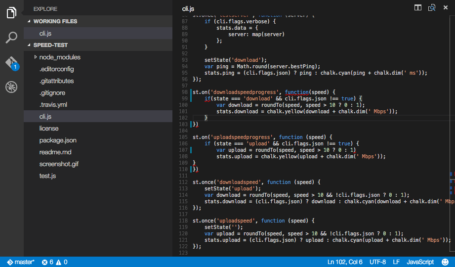

# vscode-linter-xo

[](https://travis-ci.org/spence-s/vscode-linter-xo)

> Linter for [XO](https://github.com/sindresorhus/xo)

This extension is an up to date fork of [vscode-linter-xo](https://github.com/SamVerschueren/vscode-linter-xo) by SamVerschueren and has been updated to work with all versions of XO as well as to provide better diagnostics logs and provide support for all OS and package managers. It draws heavy inspiration from the vscode eslint extension as well.

## Usage

This extensions requires that [XO](https://github.com/sindresorhus/xo) is installed locally in your workspace folder. It will not load a globally installed XO version.

```shell
$ npm install --save-dev xo
```

or

```shell
$ yarn add -D xo
```

## Notes

- XO v40.0.0 and above we're released as pure ESM modules. Therefore, it is required that NodeJS versions 12+ be used to use this extension. If you are using an older version of Node.JS please install an earlier version of XO.

In Visual Studio Code, press <kbd>F1</kbd> and narrow down the list of commands by typing `extension`. Pick `Extensions: Install Extension`.


Simply search for the `linter-xo` extension from the list and install it.

## Fix issues

Press `F1` and choose `XO: Fix all auto-fixable problems`



> Tip: Bind a keyboard shortcut to `xo.fix`

## Settings

Enable the linter in the VS Code Settings.

```json
{
	"xo.enable": true
}
```

You can also pass in extra options via the settings file.

```json
{
	"xo.enable": true,
	"xo.options": {
		"semicolon": false
	}
}
```

Or via the `package.json` file.

```json
{
	"name": "my-pkg",
	"xo": {
		"semicolon": false
	}
}
```

You can enable the formatter integration to use `xo --fix` as formatter. Requires `xo.enable` to be true. It is disabled by default.

```json
{
	"xo.enable": true,
	"xo.format.enable": true
}
```

## License

MIT © [Sam Verschueren](http://github.com/SamVerschueren)
